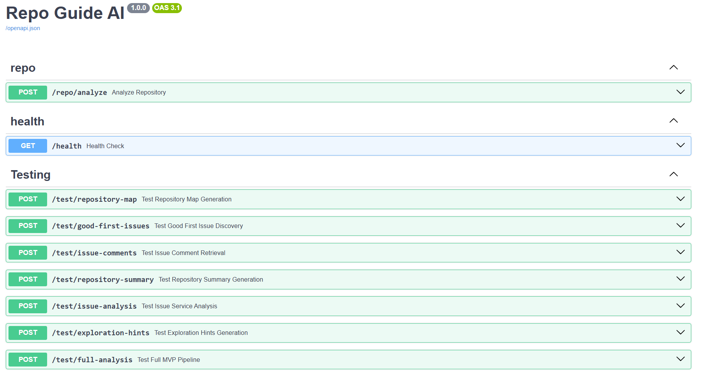
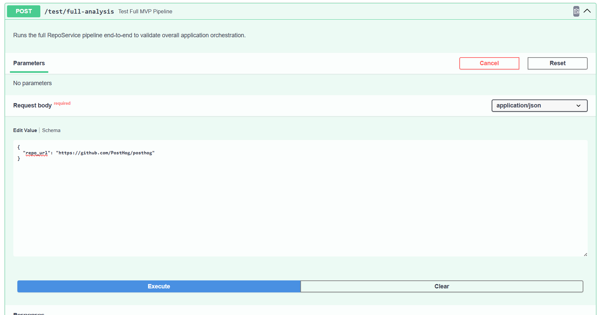

# RepoGuideAI


> AI-Powered Open Source Contribution Assistant

RepoGuideAI helps developers understand unfamiliar repositories, evaluate beginner-friendly issues, and discover where to start contributing.

Instead of spending hours reading documentation, exploring thousands of files, and trying to understand cryptic issue descriptions, RepoGuideAI provides structured repository insights, issue explanations, and exploration guidance.

---

## Current Status

✅ Backend MVP Complete (v0.1.0)

✅ Validated on Real Open-Source Repositories

✅ Repository Analysis Pipeline Operational

🚧 Frontend Dashboard In Development

Validated against:

* PostHog
* LangChain
* Supabase
* Appwrite

---

## The Problem

Most open-source contribution journeys look like this:

```text
Find Repository
      ↓
Find Good First Issue
      ↓
Don't Understand Repository
      ↓
Don't Understand Issue
      ↓
Leave Repository
```

The challenge is often not coding.

The challenge is answering:

* What does this issue actually mean?
* Can I solve it?
* Where should I start exploring?
* Which files should I read first?

RepoGuideAI was built to answer those questions.

---

## Features

### Repository Summary

Understand:

* Repository purpose
* Tech stack
* Difficulty level
* Key concepts
* Learning path

---

### Repository Map

Automatically categorize repository structure into:

* Frontend
* Backend
* Configuration
* Documentation
* Testing
* Other Areas

No manual repository exploration required.

---

### Good First Issue Discovery

Automatically discovers beginner-friendly issues using GitHub Search API.

Supports large repositories including:

* PostHog
* LangChain
* Supabase
* Appwrite

---

### Issue Analysis

Converts complex GitHub issues into beginner-friendly explanations.

Provides:

* Difficulty estimation
* Required skills
* Affected area
* Confidence score
* Simplified explanation

---

### Exploration Hints

Helps contributors discover where to start.

Provides:

* Likely directories
* Possible files
* Investigation guidance
* Reasoning

Without pretending to know the exact implementation.

---

## Architecture

```text
GitHub Repository URL
          ↓
      GitHubService
          ↓
      SummaryService
          ↓
 RepositoryMapService
          ↓
      IssueService
          ↓
 ExplorationHintsService
          ↓
 Structured JSON Output
```

---

## Backend API

### Swagger Endpoints

#### Backend Testing



#### Full Repository Analysis



---

## Example Analysis

Example repository:

### PostHog

PostHog is a large open-source product analytics platform with:

* 34k+ GitHub stars
* Python backend
* React frontend
* Feature flags
* Experimentation
* Session replay
* Product analytics

Sample analysis output:

📄 [View Full Analysis JSON](docs/sample_repo_analysis%28PostHog%29.json)

---

### Repository Summary

```json
{
  "repository_purpose": "Open-source platform for product analytics",
  "difficulty_level": "Medium",
  "tech_stack": [
    "Python",
    "React",
    "JavaScript",
    "TypeScript",
    "Docker"
  ]
}
```

---

### Example Issue Analysis

```json
{
  "difficulty": "Beginner",
  "skills_required": [
    "JavaScript/TypeScript",
    "Feature Flags",
    "Event Filtering"
  ],
  "confidence_score": 85
}
```

---

### Example Exploration Hints

```json
{
  "likely_directories": [
    "ee/api",
    "ee/models"
  ],
  "possible_files": [
    "feature_flags.py",
    "insights.py",
    "models.py"
  ]
}
```

---

## Tech Stack

### Backend

* FastAPI
* Pydantic
* PyGithub
* Groq API
* Python

### Frontend (In Progress)

* Next.js
* TypeScript
* TailwindCSS
* shadcn/ui

---

## Quick Start

Clone the repository:

```bash
git clone https://github.com/YOUR_USERNAME/RepoGuideAI.git

cd RepoGuideAI/backend
```

Install dependencies:

```bash
pip install -r requirements.txt
```

Create environment variables:

```bash
cp .env.example .env
```

Add:

```env
GITHUB_TOKEN=your_token
GROQ_API_KEY=your_key
MODEL_NAME=llama-3.3-70b-versatile
```

Run the API:

```bash
uvicorn main:app --reload
```

Open Swagger:

```text
http://localhost:8000/docs
```

---

## Backend Documentation

Detailed backend setup instructions:

```text
backend/README.md
```

---

## Roadmap

### v0.1.0

* Repository Summary
* Repository Map
* Good First Issue Discovery
* Issue Analysis
* Exploration Hints
* Structured JSON Output

---

### v0.2.0

* Next.js Frontend
* Interactive Repository Dashboard
* Repository Visualization
* Issue Detail Pages

---

### Future

* Repository Embeddings
* Semantic Search
* Exact File Localization
* Issue Similarity Search
* PR Guidance
* Contribution Checklist Generation
* Repository Memory Layer

---

## Motivation

RepoGuideAI evolved from a simple repository summarizer into an AI-powered contribution assistant focused on one goal:

> "I found a good first issue. Can I solve it, and where should I start?"

The backend MVP successfully achieves that goal and serves as the foundation for the upcoming frontend experience.

---

## License

MIT License
